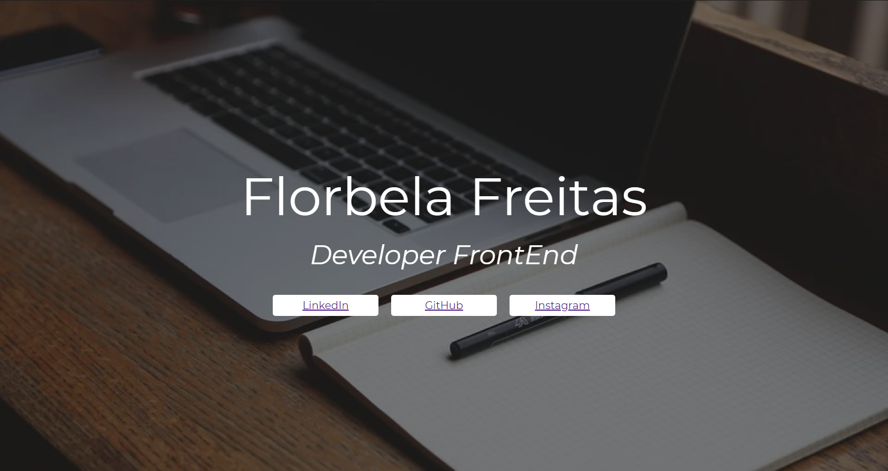

# Landing Page
Primeiro website criado, com fins didáticos, para o curso de desenvolvimento de sistemas do [SENAI Jandira](https://jandira.sp.senai.br/), com orientações do Professor [Fernando Leonid](https://github.com/fernandoleonid).

## O que é uma landing Page?
São páginas com foco principal de conversão dos visitantes. Assim, essas páginas de conversão possuem poucos elementos comparados com páginas tradicionais, evitando distrações e garantindo o objetivo.

## WebSite
O site pode ser acessado pelo link: 
[Florbela Freitas](https://florbela-freitas.github.io/Aula4-landpage/)

## Tecnologias
* HTML5
* CSS3

## Screenshot
